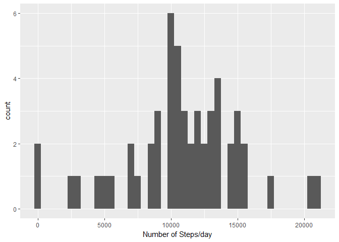
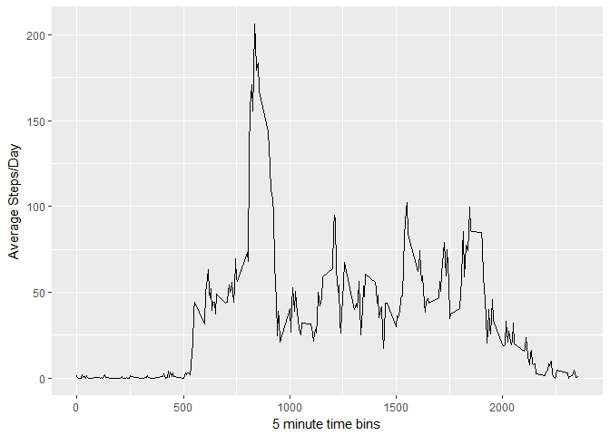
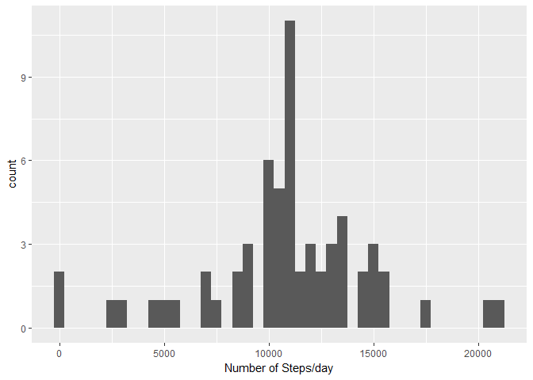
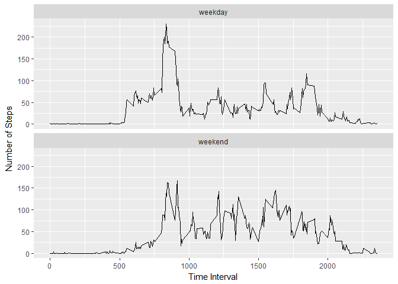

# Reproducible Research Project 1
James Mock  
September 3, 2017  


1. Load the data
We need to load the libraries, read the dataset (after unzipping) and look at the general layout of the dataset.


```r
# Load libraries
library(ggplot2)
```

```
## Warning: package 'ggplot2' was built under R version 3.4.1
```

```r
library(dplyr)
```

```
## Warning: package 'dplyr' was built under R version 3.4.1
```

```
## 
## Attaching package: 'dplyr'
```

```
## The following objects are masked from 'package:stats':
## 
##     filter, lag
```

```
## The following objects are masked from 'package:base':
## 
##     intersect, setdiff, setequal, union
```


```r
# Unzip the file and read into R, check the head and the setup of the data
if(!file.exists('activity.csv')){
    unzip('activity.zip')
}
act_data <- read.csv('activity.csv', colClasses = c("numeric", "character", "numeric"))

head(act_data)
```

```
##   steps       date interval
## 1    NA 2012-10-01        0
## 2    NA 2012-10-01        5
## 3    NA 2012-10-01       10
## 4    NA 2012-10-01       15
## 5    NA 2012-10-01       20
## 6    NA 2012-10-01       25
```

```r
str(act_data)
```

```
## 'data.frame':	17568 obs. of  3 variables:
##  $ steps   : num  NA NA NA NA NA NA NA NA NA NA ...
##  $ date    : chr  "2012-10-01" "2012-10-01" "2012-10-01" "2012-10-01" ...
##  $ interval: num  0 5 10 15 20 25 30 35 40 45 ...
```

2. Process the data into suitable format


```r
# Date is a character, convert to data format (year, month. day)
act_data$date <- as.Date(act_data$date, "%Y-%m-%d")
```

## What is mean total number of steps taken per day?

1. Calculate the total number of steps taken per day


```r
# Generate a summed steps/day
daily_steps <- aggregate(steps ~ date, act_data, sum)
```
2. If you do not understand the difference between a histogram and a barplot, research the difference between them. Make a histogram of the total number of steps taken each day


```r
(p1 <- ggplot(data = daily_steps, aes(daily_steps$steps)) + 
   geom_histogram(binwidth = 500) +
   xlab("Number of Steps/day")) 
```

<!-- -->

3. Calculate and report the mean and median of the total number of steps taken per day


```r
# Calculate the mean
mean(daily_steps$steps, na.rm = T)
```

```
## [1] 10766.19
```

The mean is 10766.19 steps per day.


```r
# Calculate the median
median(daily_steps$steps, na.rm = T)
```

```
## [1] 10765
```

The median is 10765 steps per day.

## What is the daily activity pattern?

1. Make a time series plot (i.e. type = "l") of the 5-minute interval (x-axis) and the average number of steps taken, averaged across all days (y-axis)


```r
# Generate a average steps/time bin
int_steps <- aggregate(steps ~ interval, act_data, mean, na.rm = T)
```


```r
(p2 <- ggplot(data = int_steps, aes(x = interval, y = steps)) + 
   geom_line() +
   xlab("5 minute time bins") + ylab("Average Steps/Day")) 
```

<!-- -->

2. Which 5-minute interval, on average across all the days in the dataset, contains the maximum number of steps?


```r
# Generate a summed steps/day
int_steps$interval[int_steps$steps == max(int_steps$steps)]
```

```
## [1] 835
```
Looks like time interval/bin 835 has the max number of steps. This agrees with the peak on our time-series graph between 750 and 1000.


## Imputing missing values

1. Calculate and report the total number of missing values in the dataset (i.e. the total number of rows with NAs)


```r
# Generate a summed steps/day
sum(is.na(act_data$steps))
```

```
## [1] 2304
```

The dataset has 2304 rows with missing data (reported as NA).

2.Devise a strategy for filling in all of the missing values in the dataset. The strategy does not need to be sophisticated. For example, you could use the mean/median for that day, or the mean for that 5-minute interval, etc.

I decided to use the mean number of steps for the 5 minute intervals/time bins. This requires filling in all the NAs in the original dataset with average data for that time bin across the days. 

3. Create a new dataset that is equal to the original dataset but with the missing data filled in.


```r
# New dataframe with original data
impute_act <- act_data

# Dataframe with NAs removed
act_data_clean <- subset(act_data, !is.na(act_data$steps))

# dataframe with only the rows where NA is present in steps
na_data <- is.na(impute_act$steps)

avg_int <- tapply(act_data_clean$steps, act_data_clean$interval, mean, na.rm = T, simplify = T)
impute_act$steps[na_data] <- avg_int[as.character(impute_act$interval[na_data])]

sum(is.na(impute_act$steps))
```

```
## [1] 0
```

There are now zero rows with NA data listed. Just to make sure nothing crazy happened we need to look at the histogram, mean, and median!


4. Make a histogram of the total number of steps taken each day and Calculate and report the mean and median total number of steps taken per day. Do these values differ from the estimates from the first part of the assignment? What is the impact of imputing missing data on the estimates of the total daily number of steps?


```r
daily_act_impute <- aggregate(steps ~ date, impute_act, sum)
head(daily_act_impute)
```

```
##         date    steps
## 1 2012-10-01 10766.19
## 2 2012-10-02   126.00
## 3 2012-10-03 11352.00
## 4 2012-10-04 12116.00
## 5 2012-10-05 13294.00
## 6 2012-10-06 15420.00
```


```r
(p3 <- ggplot(data = daily_act_impute, aes(daily_act_impute$steps)) + 
   geom_histogram(binwidth = 500) +
   xlab("Number of Steps/day")) 
```

<!-- -->


```r
mean(daily_act_impute$steps)
```

```
## [1] 10766.19
```

```r
median(daily_act_impute$steps)
```

```
## [1] 10766.19
```

The mean and median both now are equal and have shifted minimally from the original mean and median. They are actually both equal to the original mean.This makes sense as we imputed from the mean values, so this should get closer to the mean. Additionally, although the overall trends look the same in the histogram we have a higher frequency at several numbers (as we have imputed those numbers).

## are there differences in activity patterns between weekdays and weekends?

1. Create new factor varaible in the dataset with two levels "weekday" and "weekend" indicating whether a given date is a weekday or weekend day.

2. Make a panel plot containing the time series plot of the 5 minute interval and the average number of steps taken, averaged across all weekday or weekend days. 


```r
day_of_week <- function(w) {
    wd <- weekdays(w)
    ifelse (wd == "Saturday" | wd == "Sunday", "weekend", "weekday")
}

day_of_week_act <- sapply(impute_act$date, day_of_week)
impute_act$wk <- as.factor(day_of_week_act)

dow_agg <- aggregate(steps ~ wk+interval, data = impute_act, mean)
head(dow_agg)
```

```
##        wk interval      steps
## 1 weekday        0 2.25115304
## 2 weekend        0 0.21462264
## 3 weekday        5 0.44528302
## 4 weekend        5 0.04245283
## 5 weekday       10 0.17316562
## 6 weekend       10 0.01650943
```

Create a function to generate weekday or weekend values for the corresponding rows.

2. Make a panel plot containing a time series plot (i.e. type = "l") of the 5-minute interval (x-axis) and the average number of steps taken, averaged across all weekday days or weekend days (y-axis). See the README file in the GitHub repository to see an example of what this plot should look like using simulated data.


```r
(p4 <- ggplot(data = dow_agg, aes(x = interval, y = steps)) +
   geom_line() +
   facet_wrap(~wk, ncol = 1) +
   xlab("Time Interval") + ylab("Number of Steps"))
```

<!-- -->


